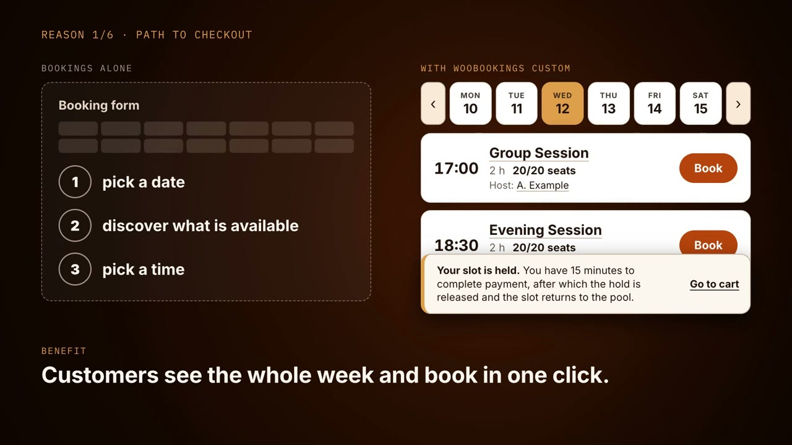

# WooBookings Custom

A companion plugin for WooCommerce Bookings. It offers a day strip and a list of slots instead of
the vendor booking form, adds special events that own the whole evening, assigns a host per
recurring slot, prices each person type on the card, and repairs three vendor behaviours that
break on a multilingual shop.

It touches no vendor file. Every behaviour is added through documented hooks, so the vendor plugin
can be updated without re-applying anything.

```
[ ‹ ]  MON 10   TUE 11   WED 12   THU 13   FRI 14   SAT 15  [ › ]     MONTH [ August ▾ ]

  17:00   Group Session                     2 h    20/20 seats   [ − 1 + ]   [ Book ]
          Host: A. Example

  18:30   Evening Session                   2 h    20/20 seats   [ − 1 + ]   [ Book ]
          Host: B. Example
```

## Video overview

[](docs/video/woobookings-custom-en.mp4)

A 67 second overview for shops that sell several sessions a day: what Bookings does on its own,
what this plugin adds, and why it is worth it. It shows the core features; person type prices,
dated host exceptions and images are described below.

- English: [docs/video/woobookings-custom-en.mp4](docs/video/woobookings-custom-en.mp4)
- Polski: [docs/video/woobookings-custom-pl.mp4](docs/video/woobookings-custom-pl.mp4)

## Why it exists

WooCommerce Bookings is solid at availability arithmetic and weak at presentation. Its native form
asks a visitor to pick a date, then discover what is available, then pick a time. A venue running
several session types a day needs the opposite: show me this week, tell me what is on, let me book
in one click.

Three further problems have no native answer at all:

| Problem | What actually happens | What this plugin does |
| --- | --- | --- |
| Multilingual bookings | WooCommerce Multilingual mirrors every new booking onto each translated product. A booking is a transaction, not translatable content, and the copies corrupt availability on a shared resource. | Removes the duplication callback at the right priority, so a booking stays one entity. |
| Stale seats on a shared resource | Bookings caches the slots the grid reads. Creating, cancelling, refunding, trashing or restoring a booking clears every product on the shared resource, with three exceptions: the cron that expires an abandoned cart clears only the expired booking's own product, deleting a booking permanently without trashing it first clears at most its own product, and saving a product clears only that product, although the exclusivity rules derive the other products' availability from its schedule. The other products then show a freed seat as taken until something else clears their cache. | Clears every product on the shared resource on all three paths, and repeats the clear on every other booking teardown so the grid does not depend on the vendor's own flush. |
| Whole-evening exclusivity | Nothing native says "while this runs, nothing else can be booked on the same resource". | A tier hierarchy (event beats session beats open entry) expressed as availability rules, so it reaches both the grid and the checkout validator. |

## What it does

- **Booking grid** rendered from a shortcode. Day strip, paging by whole pages of days, month jump,
  add to cart without leaving the page.
- **Per person type counters**. A product with person types (for example adults and children at
  different prices) gets one counter per type on the card, each with its price. The price is read
  from the same inputs Bookings sums; when the card cannot reproduce the engine's figure, it shows
  no price rather than a wrong one.
- **Special events** with their own seat cap and exclusivity over the shared resource. Blocking
  the evening is an explicit "Special event" checkbox, separate from the seat cap, so regular
  sessions can carry a cap without blocking each other.
- **Host per slot**. One shared registry of people; a default per product plus overrides for
  individual recurring slots. The assignment screen is generated from the product's own schedule,
  so nobody types a date. **Dated exceptions** cover a different person on one specific day, for
  example a guest leading a single session. They stop applying once the date has passed and are
  removed the next time the product is saved in the product editor. Published hosts (name,
  biography, featured image) are readable without login at `/wp-json/wp/v2/wbc-hosts`, as for any
  post type shown in the REST API, so keep anything private out of a host's biography.
- **Images in the details dialogs**. The product image appears in the session details, and the
  host's featured image in the host dialog opened from the host name. Descriptions stay plain
  text, so nothing from the editor becomes HTML.
- **Hold window** shortened from the vendor default, with the number quoted to the customer coming
  from the same constant that drives the real expiry.
- **Configuration validators** that refuse to fail silently. A capacity or event marker written on
  a translation, an event with no price, an event whose capacity exceeds the resource, a session
  with no bookable rule, person types that would be charged twice, a host exception the grid cannot
  show: each raises a specific admin notice naming the product.
- **Polish translation** of the plugin's own strings in `plugin/languages/`, plus Polish wording
  for Bookings' own cart messages on Polish sites, versioned with the plugin instead of living in
  a separate translation tool. A `.pot` template is included for other languages.

## Requirements

- WordPress 6.4 or newer
- PHP 8.2 or newer
- WooCommerce and WooCommerce Bookings, active
- WPML and WooCommerce Multilingual, optional. The plugin behaves correctly with or without them.
- The booking grid works out today and past slots in the Europe/Warsaw time zone, which is fixed
  in `grid.js`. In a shop in another time zone, slots near the current time are marked past or
  bookable off by the difference between that zone and Warsaw.

## Install

Copy `plugin/` into `wp-content/plugins/woobookings-custom/` and activate it. There is no build
step, no bundler and no dependency to install: the front end is one CSS file and two vanilla ES5
scripts.

Then set the anchor resource under **WooCommerce, WooBookings Custom**, and drop the shortcode on a
page:

```
[wbc_grid]
```

Every bookable product attached to that resource is discovered automatically. No product or
resource ID is hard coded. Place one grid per page: a second shortcode on the same page renders
a shell that never loads.

Deleting the plugin from the Plugins screen removes its options and the dated host exceptions.
It keeps the host posts (`wbc_host`) and the product meta for hosts and events
(`_woobookings_custom_host_default`, `_woobookings_custom_host_map`,
`_woobookings_custom_event_capacity`, `_woobookings_custom_is_event`). Bookings and WooCommerce
Multilingual data are never touched.

## How it fits together

```
  shortcode  ──▶  WBC_Grid_Data  ──▶  payload (products, days, lexicon, hosts, i18n)
                        │                        │
                        │                        ▼
                        │                  grid.js  ──fetch──▶  wc-bookings/v1/products/slots
                        │                        │
                        ▼                        ▼
                  WBC_Config              add to cart (native Woo form post)
                  (resource ──▶ products)
                        ▲
                        │
   WBC_Events ──────────┘   capacity cap + exclusivity, via three vendor filters
   WBC_WPML_Guard           duplication removed on wp_loaded, priority 1
   WBC_Cache_Flush          explicit flush on trash, cancel (refund included), hold expiry, config save
   WBC_Cost                 read layer for person type prices on the card
   WBC_Event_Review         one-time question about capped products without the marker
   WBC_Hosts                host registry (post type wbc_host, REST route wbc-hosts)
   WBC_Host_Fields          host assignment and dated exceptions in the product editor
   WBC_Event_Fields         capacity and "Special event" fields in the product editor
   WBC_Settings             settings screen and configuration validators
   WBC_Hold                 shortened cart hold window
   WBC_Image                image record for the details dialogs
   WBC_Vendor_Strings       Polish wording for Bookings' own cart messages
```

Longer version with the reasoning behind each boundary: [`docs/ARCHITECTURE.md`](docs/ARCHITECTURE.md).

## Tests

```bash
php tests/php/run.php            # 65 assertions, no WordPress needed
node --test tests/js/slots.test.js   # 13 tests, no DOM needed
```

Both suites are dependency free and run in under a second, which is deliberate. The logic worth
testing here is arithmetic, not integration: month arithmetic that overflows, weekday numbering
that differs between JavaScript and ISO, a parser that has to keep weekly time rules and ignore
every other rule type. Those are exactly the failures that produce a wrong booking rather than a
crash. The pieces that call WordPress (the event review, configuration reads and shortcode
registration) run against small in-memory stand-ins for the functions they call.

CI additionally lints every PHP file across three PHP versions, syntax checks every script,
refuses debug statements in shipped code unless a PHP line is marked as a deliberate diagnostic,
checks that every PHP file except uninstall.php (which has its own guard) blocks direct access,
and fails the build if the plugin header version drifts from the constant.

## Notable implementation notes

Collected because each one cost real debugging time. Full list in
[`docs/GOTCHAS.md`](docs/GOTCHAS.md).

- **Specificity is load bearing.** Themes paint every button on hover **and** focus from one
  selector. Covering only `:hover` leaves a foreign colour on screen after a mouse click, because a
  click leaves focus behind and `:focus-visible` does not match it. Source order breaks ties, so
  `:focus` must precede `:hover`.
- **A state must never change geometry.** A hover rule that adds padding grows the element and the
  list jumps under the cursor. Colour and outline are safe; padding, border and margin are not.
- **`document.createElement('svg')` returns an HTMLUnknownElement.** It renders nothing and throws
  nothing. Inline SVG needs `createElementNS`.
- **Weekday keys follow ISO, JavaScript does not.** `getUTCDay()` calls Sunday 0 while the map keys
  call it 7. The weekday is derived with UTC arithmetic over naive ISO parts so a daylight saving
  transition cannot move a slot to the wrong day.
- **Availability keys on the canonical product.** A value written on a translation is invisible to
  the runtime. That is a silent failure, so a validator shouts instead of letting it degrade.

## Changelog

- **1.3.0** Dated host exceptions for a single day, ignored by WPML on translations. Admin and grid
  strings use English source text, so a site in another language no longer shows Polish labels;
  Polish sites keep Polish through the bundled `pl_PL` translation. The hosts REST route is now
  `wbc-hosts` (was `wbc-hostowie`) and the script handles `wbc-grid` and `wbc-grid-slots` (were
  `wbc-nordic-grid` and `wbc-nordic-grid-slots`).
  **Updating from 1.0.0:** right after the update a product that has only a seat cap no longer
  blocks the evening. An admin notice, shown as an error until it is answered, lists the published
  products on the resource that have a seat cap but no Special event tick (open entry excepted),
  with one button to mark them as special events and one to keep them as regular sessions. Answer
  it soon after updating, and check drafts, scheduled, pending and private products yourself; they
  are not listed. The grid shortcode is now registered as `[wbc_grid]`, the name this README has
  always given; the 1.0.0 name `[wbc_grid_rezerwacji]` keeps working.
- **1.2.0** Per person type counters with prices on the card, pricing health notice, Polish wording
  for Bookings cart messages.
- **1.1.0** Product and host images in the details dialogs; the whole evening exclusivity moves to
  an explicit "Special event" checkbox, so a seat cap alone only limits seats. Open entry can no
  longer block the evening.
- **1.0.0** Booking grid, special events, host per slot, cache flushing, WPML guard.

## Licence

GPL-2.0-or-later, matching WordPress and the vendor plugin it extends.
